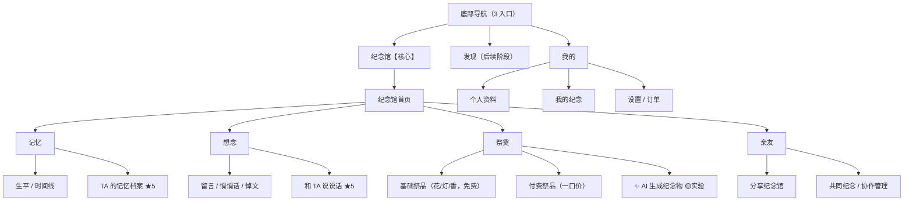
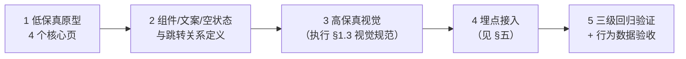
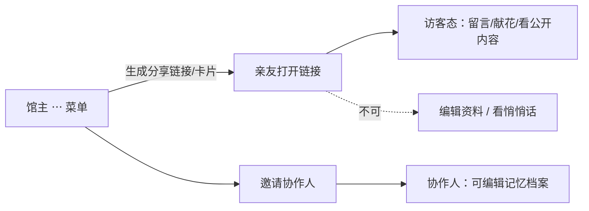

# 彼岸 · 前端具体设计流程与设计图纸

> 依据：《前端操作界面具体设计建议》《彼岸_逝者AI_产品架构与MVP验证建议》《彼岸_线上祭品与AI生成祭品_产品判断与架构建议》三份讨论稿整合而成。
> 本文是前端实施的唯一界面要求来源：页面结构、控件清单、文案边界、状态定义、流程与埋点。

---

## 一、全局设计原则（所有页面强制遵守）

1. **纪念馆是主体，AI 不是主角**：用户进入的是「TA 的纪念馆」。任何入口、按钮、文案不得出现「AI 聊天」「AI 数字人」「复活逝者」等技术型/敏感命名。
2. **三个核心动作组织一切**：记住 TA（记忆）· 和 TA 说说话（想念）· 为 TA 做点什么（祭奠）。
3. **一级导航只有 3 个**：`纪念馆`｜`发现`（后续阶段）｜`我的`。AI 能力不设一级入口。
4. **商业化红线**：全部一口价明码标价；禁止虚拟币/云币/充值礼包/打榜/攀比/情感诱导话术/默认自动续费；基础祭奠（鲜花/蜡烛/清香）低门槛或免费。
5. **诚实原则**：AI 不知道就承认不知道并引导补充记忆；推测类回答必须带「基于资料的推测」标识。
6. 所有列表/对话必须定义**空状态、加载状态、错误状态**文案。
7. 「和 TA 说说话」归入**想念**；「AI 生成纪念物」归入**祭奠**。

### 1.1 信息架构总图



### 1.2 设计推进流程



### 1.3 视觉设计规范（庄重 · 低技术感 · 有温度）

**色彩系统**

| 角色 | 色值 | 用途与限制 |
|---|---|---|
| 主色 · 黛蓝灰 | `#3E4C59` | 导航、标题、主要文字控件；沉稳不压抑 |
| 背景 · 宣纸白 | `#F7F5F0` | 全局页面底色，略带暖度，不用纯白 |
| 辅助 · 暖灰 | `#8A8578` | 分割线、次要图标、弱信息 |
| 点缀 · 烛火橙 | `#D98E4A` | **仅**主 CTA、点灯/供奉动作、少量重点；克制使用，一屏不超过 2 处 |
| 成功 · 黛绿 | `#5B7F5C` | 保存成功、供奉完成 |
| 警示 · 赭红 | `#A85448` | 错误、删除等破坏性操作（低饱和，不用正红） |
| 文字 | 主 `#2B2B2B` / 次 `#6E6A61` / 弱 `#A39E93` | 三级文字灰度，正文对比度 ≥ 4.5:1 |

- 禁止：高饱和渐变、霓虹色、科技蓝/亮紫、纯黑纯白硬对比、玻璃拟态。

**字体与排版**

- 标题用衬线体（思源宋体），传递书卷气与纪念感；正文/UI 控件用无衬线（思源黑体或系统默认）。
- 字号阶梯（基准比常规 App 大一号，照顾中老年用户）：页面大标题 24 / 区块标题 17 / 正文 16 / 辅助说明 13。
- 行高 1.6；段落间距 ≥ 16px；每屏信息密度主动留白，不追求塞满。

**形状、质感与图标**

- 圆角统一：卡片 12px，主按钮全圆角（高度一半）；不用尖角。
- 阴影只用一级轻投影 `0 2px 8px rgba(0,0,0,0.06)`，禁止多层重阴影。
- 纪念馆皮肤允许纸纹/淡墨质感背景；禁止炫光、粒子、跑马灯特效。
- 图标：2px 线性描边、圆角端点、风格统一；祭品图标（🌸🕯🌿）保持具象温情风格，全端一致。

### 1.4 交互与动效规范

1. 动效只服务于「安静、庄重」：时长 200–300ms，ease-out；页面转场统一右进左出，弹层自底部升起，禁止弹跳/弹性过冲。
2. 点烛/献花的供奉动效 ≤ 1.2s，无金币、无连击、无排行榜；音效默认关闭，开启需在设置中明示。
3. 所有可点区域 ≥ 44×44pt；主 CTA 全宽、高 52px；相邻可点元素间距 ≥ 8px 防误触。
4. 加载超过 300ms 才显示骨架屏/加载态，避免闪烁；骨架屏用暖灰呼吸块，不用旋转菊花。
5. 对话页键盘弹出时输入框吸附键盘顶部，快捷 chip 自动收起；键盘收起后恢复。
6. 列表统一支持下拉刷新；删除类操作二次确认，确认弹窗用赭红标识破坏性。
7. 全端适配安全区（iOS 底部横条 / Android 手势区），底部固定按钮不得被遮挡。

### 1.5 适老化与无障碍

1. 支持系统字体放大至 130% 不截断、不错位、不遮挡；核心流程在最大字号下可走通。
2. 关键操作双通道反馈（颜色 + 文案/图标），不单靠颜色传达成败。
3. 所有图片有替代文本；供奉/留言等动作有明确的结果提示文案。
4. 预留「长辈模式」开关（V1.x 后置）：字号 +2、首页简化为三个大按钮（记忆/说说话/祭奠）、隐藏实验性入口。

---

## 二、页面设计图纸与控件清单

> 图纸为低保真线框（移动端 375px 基准）。【】= 可点击控件；（馆主）= 仅馆主/协作人可见。

### 2.1 纪念馆首页 ★★★★★

**页面目标**：一进入就感受到「这是 TA」，30 秒内完成看/说/做之一。

```
┌──────────────────────────────┐
│ ←                          ⋯ │ ←（⋯：分享/编辑资料/协作管理(馆主)、举报(访客)）
│         [TA 的照片]          │ ← 可点击放大
│          TA 的名字           │
│       XXXX — XXXX            │
│       “想念从未离开”          │
│    【 和 TA 说说话 】         │ ← 唯一主 CTA，全宽大按钮
├──────────────────────────────┤
│   记忆    │   想念   │  祭奠  │ ← 三等宽 Tab（页内锚点）
├──────────────────────────────┤
│  TA 的人生                   │
│  1940  出生                  │
│  1965  结婚            【+】│ ← 添加（馆主）
│  ……                          │
│  （空状态：还没有记录 TA 的故事）│
├──────────────────────────────┤
│  最近的纪念                   │
│  🌸 献花   李**   2 小时前    │
│  💬 留言   用户A   昨天       │
│  🕯 点灯   王**   3 天前      │
│  （空状态：成为第一个纪念 TA 的人）│
└──────────────────────────────┘
```

| 控件 | 文案/规格 | 行为 |
|---|---|---|
| 主 CTA | 和 TA 说说话 | 首次→身份说明页（§2.3）；再次→对话页（§2.4）。埋点：对话入口点击 |
| 照片 | TA 的照片 | 点击全屏查看 |
| ⋯ 菜单（馆主） | 分享纪念馆 / 编辑纪念馆资料 / 协作管理 | 弹出 action sheet |
| ⋯ 菜单（访客） | 举报 | 举报表单 |
| Tab×3 | 记忆 / 想念 / 祭奠 | 平滑滚动锚点定位 |
| 时间线【+】 | 添加 | 打开生平事件编辑抽屉（馆主） |

**视觉与交互细节**：

- 顶部沉浸区（照片 + 名字 + 生卒年 + 一句寄语 + 主 CTA）占首屏约 60%，照片以 1:1 圆形或 4:5 圆角卡片呈现，下方垫一层宣纸白→透明渐变遮罩，保证文字可读。
- 名字用衬线 24px，生卒年与寄语用辅助灰 13px；寄语字号小、不抢戏。
- Tab 栏滚动到顶后吸顶，当前 Tab 用烛火橙下划线（2px）标识，不用色块填充。
- 「最近的纪念」条目左图标（祭品/留言类型）、中文字（打码昵称）、右相对时间；超过 5 条折叠为「查看全部纪念」。
- 空状态不只一句文案：配一枚线性小图标 + 引导按钮（如「记录 TA 的第一个故事」），把空状态变成任务起点。

---

### 2.2 想念页 ★★★★★

**页面目标**：覆盖「我想对 TA 说」（表达）与「我想和 TA 交流」（对话）两条路径。

```
┌──────────────────────────────┐
│ ←            想念             │
│   今天想和 TA 说些什么？       │
│          [TA 的照片]          │
│    “想说的话，可以告诉我。”     │
│      【 和 TA 说说话 】        │
├──────────────────────────────┤
│  留下你的话                   │
│  ┌────────────────────────┐  │
│  │ 写下想对 TA 说的话……    │  │ ← 多行输入，限 500 字 + 计数
│  └────────────────────────┘  │
│   悼文    悄悄话    留言      │ ← 单选类型标签（默认：留言）
│         【 提 交 】           │
└──────────────────────────────┘
```

| 类型 | 语义 | 展示规则 |
|---|---|---|
| 留言 | 公开表达 | 出现在「最近的纪念」流，所有人可见 |
| 悄悄话 | 私密表达 | 列表带 🔒，仅作者本人可见 |
| 悼文 | 正式纪念 | 馆内置顶展示 |

- 提交成功 → toast「已留下」+ 列表刷新；空内容时提交按钮置灰。

---

### 2.3 「和 TA 说说话」身份说明页（首次必经，不可折叠/跳过）

```
┌──────────────────────────────┐
│        和 TA 说说话           │
│          [TA 的照片]          │
│  根据 TA 的文字、故事、照片等   │
│  资料构建纪念性 AI。           │
│  它不是 TA 本人，也不能真正    │
│  代表 TA。                    │
│  • 帮你回忆 TA                │
│  • 听你说说话                 │
│  • 根据已有记忆尝试回应        │
│   【 开始和 TA 说说话 】       │
└──────────────────────────────┘
```

- 声明文案**逐字使用，不可删改**；点击按钮 = 确认边界 + 进入对话页（埋点：对话入口点击）。

---

### 2.4 AI 对话页 ★★★★★（核心 CTA）

```
┌──────────────────────────────┐
│ ←      和爷爷说说话        ⋯ │ ←（⋯：清空对话 / 反馈问题）
│          [TA 头像]            │
│  ───────── 今天 ─────────     │
│  你：爷爷，我今天工作特别累。  │
│  ┌────────────────────────┐  │
│  │TA：如果是以前，爷爷大概 │  │
│  │会先问你有没有好好吃饭。  │  │
│  │  [查看这句话的依据]      │  │ ← 有记忆依据时才显示
│  └────────────────────────┘  │
│       （推测类回答角标：       │
│        “基于 TA 的资料推测”   │
│        灰色小字，不可关闭）    │
├──────────────────────────────┤
│  你可以问：                   │
│  “TA 以前最喜欢什么？”        │ ← 快捷 chip ×3，
│  “我想听听 TA 的故事。”       │    空对话时显示
│  “我今天有点想 TA。”          │
│ ┌──────────────────────────┐ │
│ │ 想对 TA 说……        🎙 ↑ │ │ ← 🎙 V1 置灰占位
│ └──────────────────────────┘ │
└──────────────────────────────┘
```

**顶栏标题规则**：`和 + 称谓 + 说说话`（如「和爷爷说说话」），称谓取自纪念馆设置。

**「回答依据」弹层**（点击 [查看这句话的依据]）：

```
┌──────────────────────────────┐
│         这句话的依据          │
│ 📖 你记录的故事               │
│ “爷爷每次打电话都会问         │
│  我有没有吃饭……”             │
│ 📅 添加于 2026.08.12         │
│         【 关闭 】            │
└──────────────────────────────┘
```

- 无依据的回答**不显示**该链接（禁止出现空链接/「无依据」提示）。

**「补充记忆」闭环**（AI 不知道时）：

```
TA：我还没有找到关于这件事的记录。
    如果你愿意，可以告诉我：
    爷爷什么时候开始喜欢钓鱼？
    [ 添加一段关于 TA 的记忆 ]
        ↓ 点击
┌──────────────────────────────┐
│ 添加记忆 → 分区自动匹配        │
│ “他年轻的时候经常带我去河边……”│
│         【 保存 】            │
└──────────────────────────────┘
        ↓ 保存后
toast「已保存到 TA 的记忆档案」→ 自动回到对话继续
```

- 埋点：对话后新增记忆（闭环：AI 对话 → 新记忆 → 纪念馆 → AI 进一步理解 TA）。

**对话页状态**：

| 状态 | 表现 |
|---|---|
| AI 回复中 | 气泡内三点呼吸动画 + 「正在想你问的话…」，可中断 |
| 网络/服务错误 | 气泡位显示「刚才没说上话，再试一次」+【重试】 |
| 敏感内容 | 提示「这个话题我们轻轻带过」，不展开 |

**对话页视觉规格**：

- 用户气泡右对齐，黛蓝灰 `#3E4C59` 底 + 白字；TA 气泡左对齐，白底（`#FFFFFF`）+ 一级轻投影，左侧带 TA 的小头像（24px 圆形），让「是 TA 在说」有视觉锚点。
- 气泡最大宽度为屏宽 78%，圆角 12px（TA 气泡左上小圆角 4px 作指向），行高 1.6。
- 日期分隔线「── 今天 ──」用弱灰 13px，两侧细线。
- 「查看这句话的依据」用 13px 黛蓝灰下划线文字链，不用按钮；推测角标 `#A39E93` 12px 置于气泡正下方。
- 快捷 chip 为白底描边胶囊（暖灰 1px 描边），点击整句上屏；对话开始后自动隐藏。
- 输入框白底圆角 24px，占位文案「想对 TA 说……」；发送按钮无内容时置灰，🎙 置灰态透明度 40% 且点击 toast「语音功能正在准备中」。

---

### 2.5 TA 的记忆档案页 ★★★★★（核心基础设施）

```
┌──────────────────────────────┐
│ ←      TA 的记忆档案          │
│      已建立 32 条记忆         │
│ 👤 TA 是怎样的人              │
│    温和、幽默、喜欢喝茶        │
│ ❤️ 我和 TA        ★关系记忆   │ ← 视觉略强调
│    我们第一次一起旅行……       │
│ 🎵 TA 喜欢什么                │
│    京剧、茶、钓鱼……           │
│ 💬 TA 怎么说话                │
│    “慢慢来，不着急。”          │
│ 📄 基础资料                   │
│    姓名 / 出生 / 家庭 / 职业   │
│   【 ＋ 添加记忆 】（底部固定）│
└──────────────────────────────┘
```

| 分区 | 收录内容 | 空状态文案 |
|---|---|---|
| 👤 TA 是怎样的人 | 性格、价值观、生活态度 | 「还不知道怎么描述 TA？」 |
| ❤️ 我和 TA | 用户与 TA 的共同回忆 | 「你们的故事值得被记住」 |
| 🎵 TA 喜欢什么 | 食物/音乐/电影/书/地方/兴趣 | 「TA 平时喜欢做什么？」 |
| 💬 TA 怎么说话 | 常用语、口头禅、称呼、语言习惯 | 「TA 常挂在嘴边的话是？」 |
| 📄 基础资料 | 姓名、出生、家庭、职业、生平 | 引导填写 |

- 每条记忆：点击编辑 / 左滑删除（馆主与协作人权限）。
- 添加流程：【＋ 添加记忆】→ 选分区 → 文本录入（预留语音转文字）→ 保存。

---

### 2.6 「如果 TA 在，会怎么说？」页

```
┌──────────────────────────────┐
│         如果 TA 在……          │
│   有什么事情，你想听听         │
│   TA 可能会怎么说？            │
│ ┌──────────────────────────┐ │
│ │ 如果爷爷知道我最近辞职了…  │ │
│ └──────────────────────────┘ │
│        【 试着问问 】          │
│ ℹ️ 回答会基于你记录的 TA       │
│   的经历和性格进行推测。       │ ← 强制脚注，不可省略
└──────────────────────────────┘
```

- 所有回答必须用「TA **可能**会怎么说」句式；回答底部固定灰字「基于 TA 的资料推测」。

---

### 2.7 祭奠页 ★★★★

```
┌──────────────────────────────┐
│             祭奠              │
│      今天想为 TA 做什么？      │
│    🌸       🕯       🌿       │
│   献花     点灯     清香      │ ← 基础三项：免费/低门槛
│    🍎       🍵       🎁       │
│   水果      茶      纪念物     │ ← 付费：点击弹一口价确认
│                              │
│  ✨ 为 TA 准备特别的礼物       │ ← 次级入口，视觉弱于宫格
│  （AI 生成纪念物）             │
└──────────────────────────────┘
```

**一口价确认弹窗**（付费祭品）：

```
┌──────────────────────────────┐
│         🍵 敬一杯茶           │
│      一口价 ¥6                │
│  会出现在纪念馆的供桌上        │
│    【 供奉 】    【 取消 】    │
└──────────────────────────────┘
```

- 弹窗内禁止：倒计时、库存话术、他人已购对比、任何攀比元素。
- 供奉成功 → 供桌/纪念流即时刷新 + 温和动画（无金币/音效轰炸）。

**祭奠页视觉与交互细节**：

- 宫格为 3 列白底卡片，图标 32px + 名称 13px；免费三项（献花/点灯/清香）右上角带「免费」小标（黛绿 12px），付费项直接标「¥X」小字，价格在点击前可见，不做隐藏定价。
- 「点灯」供奉后，首页与供桌出现一支小火焰呼吸动效（烛火橙，≤1.2s 后转为微弱常亮），持续 24 小时自然熄灭，可用自然文案提示「灯还亮着」。
- 「✨ 为 TA 准备特别的礼物」入口为通栏描边卡片，视觉权重明显低于宫格，不加角标红点等催促元素。
- 付费确认弹窗的元素白名单见 §六-3；弹窗背景遮罩 40% 黑，点击遮罩 = 取消。

---

### 2.8 AI 生成纪念物页 🟡（创新实验）

**定位文案**：「为 TA 准备一份礼物」。禁止定义为「AI 生图工具」。

```
第 1 步               第 2 步                第 3 步
┌──────────────┐  ┌──────────────┐  ┌──────────────┐
│TA 生前最喜欢  │  │你想送 TA 什么？│  │  [纪念物大图] │
│什么？         │  │              │  │“这是我想送给  │
│[很喜欢喝茶]   │→ │[一套特别的    │→ │ 你的。”       │
│              │  │  茶具]       │  │【收藏到纪念馆】│
│              │  │【帮我写】     │  │【分享给亲友】 │
│              │  │  (每日限量)  │  │【再准备一件】 │
│              │  │【帮我准备】   │  │              │
└──────────────┘  └──────────────┘  └──────────────┘
```

| 控件 | 行为 |
|---|---|
| 【帮我写】 | 输入心愿 → AI 扩写为生成描述；每日限量，超量提示「明天再来」 |
| 【帮我准备】 | 提交生成（一口价明示）；生成中可离开，完成后站内通知 |
| 【收藏到纪念馆】 | 存入「TA 的纪念物」，供桌可见 |
| 【再准备一件】 | 回到第 1 步 |
| 失败 | 自动退费 + 明示「没有准备好，已退款」 |

---

### 2.9 我的 页

```
┌──────────────────────────────┐
│  [头像]  李**                 │
│  ├── 个人资料                 │
│  ├── 我的纪念                 │ ← 我创建/协作/纪念过的纪念馆
│  ├── 订单记录                 │ ← 一口价流水，可查每笔
│  └── 设置                     │ ← 通知/隐私/注销
└──────────────────────────────┘
```

### 2.10 亲友共同纪念 ★★★★



### 2.11 通用组件规格（所有页面复用）

| 组件 | 规格 | 状态要求 |
|---|---|---|
| 主按钮 | 全宽、高 52px、全圆角、烛火橙底白字 17px | 默认 / 按下（透明度 85%）/ 置灰（暖灰底 `#D8D4CC`） |
| 次按钮 | 同尺寸，白底 + 黛蓝灰 1px 描边 | 同上 |
| 危险按钮 | 文字按钮，赭红 `#A85448` | 删除类操作必经二次确认弹窗 |
| 输入框 | 白底、圆角 12px、聚焦时 1.5px 黛蓝灰描边 | 默认 / 聚焦 / 错误（赭红描边 + 13px 错误文案）/ 禁用 |
| Toast | 底部居中上浮 16px，深色半透明底（`rgba(43,43,43,0.88)`）白字 14px，停留 2s | 成功前可加小图标，不做进度条 |
| Action Sheet | 底部升起，首行标题，末行「取消」独立成组 | 破坏项用赭红文字 |
| 弹窗（Dialog） | 宽度 = 屏宽 - 64px，圆角 16px，遮罩 40% 黑 | 单弹窗原则，禁止弹窗叠弹窗 |
| 骨架屏 | 暖灰呼吸块（`#E8E4DC` ↔ `#F0EDE6` 渐变呼吸） | 加载 > 300ms 才显示 |
| 空状态 | 线性小图标 + 一句说明 + 一个引导按钮 | 每页必配，见 §一-6 |
| 打码昵称 | 「李**」「用户A」格式，全端统一脱敏 | 任何列表不得出现完整真实姓名 |

---

## 三、文案边界对照表（前端审查清单）

| ✅ 允许 | ❌ 禁止 |
|---|---|
| 和 TA 说说话 / 纪念性 AI | AI 聊天、数字人、复活逝者、AI 逝者 |
| 想 TA 的时候，可以来和 TA 说说话 | AI 可以治愈你的思念 |
| 把没来得及说的话，再说给 TA 听 | AI 可以代替逝者陪伴你 |
| TA **可能**会怎么说 | TA 会怎么说 |
| 付费买表达 | 任何孝心绑定话术、充值礼包、打榜 |
| 一口价 ¥X | 云币、金币、充值换算、礼包 |

## 四、页面优先级与实施范围

| 页面/功能 | 优先级 | 范围 |
|---|---|---|
| 纪念馆首页 | ★★★★★ | P0 |
| 和 TA 说说话（说明页+对话页） | ★★★★★ | P0 |
| TA 的记忆档案 | ★★★★★ | P0 |
| 记忆时间线 | ★★★★★ | P0 |
| 留言 / 悄悄话 / 悼文 | ★★★★ | P0 |
| 基础祭奠 | ★★★★ | P0 |
| 亲友共同纪念 | ★★★★ | P1 |
| 付费祭品 | ★★★★ | P1 |
| AI 生成纪念物 | ★★★ | P1（实验，入口降权） |
| 高拟真数字人 / 声音 | ★★ | 暂缓（🎙 置灰占位） |
| 发现页 | — | 后续阶段 |

## 五、埋点要求（每页必埋）

| 埋点 | 服务的验证指标 |
|---|---|
| 对话入口点击 | 兴趣：入口点击率 |
| 首轮对话完成 | 首次体验成立率 |
| 对话轮次/时长 | 深度使用 |
| 7/30 日回访 | 持续使用（极高权重） |
| 对话后新增记忆 | 记忆沉淀闭环 |
| AI 纪念物漏斗（点击→启动→完成→保存/分享/再生成） | 实验功能五级验证 |
| 祭品点击与付费转化 | 商业化验证 |
| AI 用户 WAR vs 普通用户 WAR | 战略价值判断 |

## 六、验收口径

1. 每个页面有空/加载/错误三态截图。
2. 文案边界表逐条过审（§三）。
3. 一口价弹窗元素白名单：图标+名称+价格+说明+双按钮，出现任何其他元素即打回。
4. 4 个核心页（首页/想念页/对话页/记忆档案页）先出低保真原型评审，通过后进入高保真。
5. 高保真走查对照 §1.3 视觉规范：色值、字号阶梯、圆角、阴影逐项核对，色偏/字号不一致即打回。
6. 动效走查：全部转场与反馈动效 ≤ 300ms，供奉动效 ≤ 1.2s，无音效默认关闭。
7. 适老化抽测：系统字号放大至 130% 后，首页、对话页、祭奠页核心流程可走通，无截断遮挡。
8. 可点区域抽检：所有可点元素 ≥ 44×44pt，安全区无遮挡。

---

## 七、实施进度（2026-08-23 更新，四方并行开发合并后）

> 验证依据：四路冒烟连跑全绿（A 40/40、B chat PASS、C 55/55、D 总回归 19/19×2），详见 `docs/07-联调记录.md`。

| 条目 | 优先级 | 状态 | 验证 |
|---|---|---|---|
| 纪念馆首页（混合纪念流/Tab 锚点/供奉区） | P0 | ✅ 已实现 | hall-check A1–A8 + check-pages C 系 |
| 和 TA 说说话（对话页 + evidence 依据 + askMemory 补充记忆闭环） | P0 | ✅ 已实现 | check-chat（evidence/ask-memory/moderation/guest） |
| TA 的记忆档案（5 分区增删改查） | P0 | ✅ 后端全通 + 页面已实现 | check-memories 19/19 + check-pages B 系 |
| 留言 / 悄悄话 / 悼文（可见性服务端强制） | P0 | ✅ 已实现 | check-messages 21/21（含 private 越权负例） |
| 基础祭奠（免费供奉） | P0 | ✅ 已实现 | hall-check A7/A8 |
| 混合纪念流 feed（tributes ∪ messages，打码展示） | P1 | ✅ 已实现 | hall-check B1–B8 |
| 付费祭品一口价链路（order_id 校验，已支付才放行） | P1 | ✅ 后端链路已通 | hall-check C1–C3（mock 订单） |
| 文案红线（无 AI 聊天/数字人/复活/虚拟币/充值/打榜） | — | ✅ 回归覆盖 | check-pages F/L 系 |
| 亲友共同纪念 | P1 | ✅ 已实现（2026-08-23） | check-p1-family-gift（邀请码加入/更换失效/越权负例/成员打码） |
| AI 生成纪念物页（三步流） | P1 | ✅ 已实现（2026-08-23） | check-p1-family-gift（帮我写限量/帮我准备幂等/收藏/外部 URL 拦截） |
| 我的页「我的纪念」聚合 | P2 | ⬜ 未开始 | — |
| 发现页 | 后续 | ⬜ 未开始 | — |

**已知待办**：
1. C 路记忆档案页 SSR 仍带 mock 兜底数据（check-pages B6/B7 即按此断言），接真实 `/api/memories` 后需同步更新该断言。
2. 付费祭品的真实 Stripe 下单→支付回调→`/api/tribute` 全链路未做端到端验证（目前为 mock 订单冒烟）。
3. feed 的 `createdAt` 为 UTC 时间串，前端展示需做时区换算。
4. 新页面入口：`/zh/family/:id`（亲友共同纪念，馆主可生成/更换邀请链接，成员列表打码展示）、`/zh/gift/:id`（为 TA 准备一份礼物，三步流）；hall 页供奉区下方已接入两个入口（亲友入口仅馆主可见）。收藏的生成物 `review_status='pending'`，需审核后才对非本人可见。
